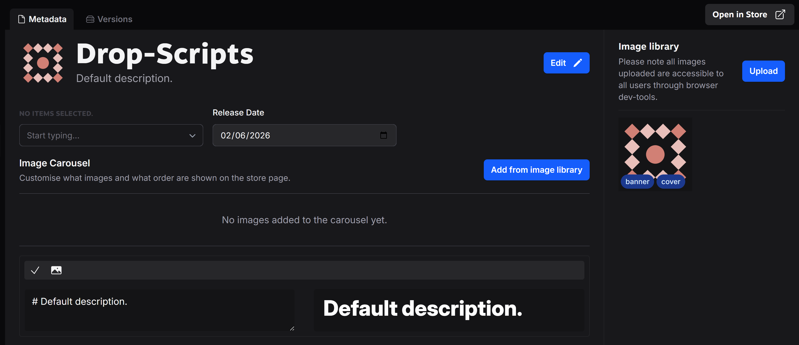
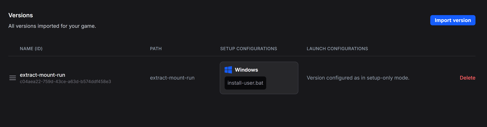

# Drop-Scripts

A collection of utility scripts for Drop instances, specializing in handling multi-part RAR archives and ISO mounting.

## Scripts

### extract-mount-run
Extracts RAR files, mounts ISO images, and runs executables.

**Files:**
- `extract-mount-run.bat` - Main extraction and execution script
- `exr-setup.bat` - Game setup launcher for multi-part archives
- `install-user.bat` - User installation/setup script








## Latest Updates

I updated this to add support for multi-part GOG installers, inno-setup directory matching the Drop install folder, and adding an executable as a startup item.

Simply add:
- Setup item: exr-setup.bat
- Run item: drop-start.bat

## Adding Drop-Scripts to Your Drop Instance

### Step 1: Import the Executor

1. In your Drop instance, navigate to **Executors** or **Add Executor**
2. Create a new executor pointing to the Drop-Scripts directory
3. Set the executor name (e.g., "DropScripts" or "extract-mount-run")
4. Confirm the path points to your Drop-Scripts installation

### Step 2: Create a Version for extract-mount-run

1. In your Drop instance, create a new **Version**
2. Configure the version as follows:

   | Setting | Value |
   |---------|-------|
   | **Setup Configuration** | Windows: `install-user.bat` |
   | **Launch Configuration** | Setup-only mode (no launch config) |

3. This version handles basic RAR extraction and ISO mounting with EXE selection

### Step 3: Create a Version for Multi-Part Archives with ISOs

For games distributed as multi-part RAR archives with ISO files, create an additional version:

1. Create a new **Version**
2. Configure the version as follows:

   | Setting | Value |
   |---------|-------|
   | **Setup Configuration** | Windows: `exr-setup.bat` |
   | **Launch Configuration** | Windows: `drop-start.bat` |

3. This version uses the enhanced launcher optimized for multi-part archives

## Usage

### For Basic RAR/ISO Extraction

Use the `extract-mount-run` version:
- Drop will execute `install-user.bat` during setup
- The script will prompt you to select a RAR file and executable
- Alternatively, pass RAR and EXE parameters directly:
  ```batch
  extract-mount-run.bat "path\to\archive.rar" "setup.exe"
  ```

### For Multi-Part Archives

Use the `extract-mount-run-multipart` version:
- Drop will execute `exr-setup.bat` during setup
- This handles multi-part RAR archives (.rar, .r00, .r01, etc.)
- The script automatically finds and extracts the main RAR file
- Locates and mounts ISO files from the extracted contents
- Executes the selected or specified EXE file

## Requirements

- **7-Zip**: Must be installed at one of these paths:
  - `C:\Program Files\7-Zip\7z.exe`
  - `C:\Program Files (x86)\7-Zip\7z.exe`
  
  [Download 7-Zip](https://www.7-zip.org/)

- **Windows PowerShell**: For ISO mounting/unmounting operations (included with Windows)

- **Administrator Rights**: Required for mounting ISO disk images

- **Windows OS**: Scripts are designed for Windows systems

## How It Works

1. **Extraction Phase**:
   - Script searches for RAR files in the current directory
   - Creates a temporary working directory
   - Uses 7-Zip to extract the RAR archive(s)

2. **Discovery Phase**:
   - Searches for ISO files in the extracted contents
   - Lists available executables on the mounted ISO
   - Prompts user to select an executable (if not specified)

3. **Mount & Execute Phase**:
   - Mounts the ISO using PowerShell's `Mount-DiskImage` cmdlet
   - Executes the selected EXE file
   - Returns the executable's exit code

4. **Cleanup Phase**:
   - Unmounts the ISO image
   - Removes all temporary extraction files
   - Closes the command window

## Troubleshooting

| Issue | Solution |
|-------|----------|
| **7-Zip not found** | Install 7-Zip from https://www.7-zip.org/ |
| **ISO mount fails** | Ensure you're running with administrator privileges |
| **EXE not found** | Verify the executable exists in the ISO root or subdirectories |
| **RAR extraction fails** | Check that the RAR file is not corrupted and 7-Zip is properly installed |
| **Permission denied** | Run Drop instance with administrator privileges for ISO mounting |

## File Reference

- **extract-mount-run.bat**: Core script handling RAR extraction, ISO mounting, and EXE execution
- **setup.bat**: Simple launcher that spawns a new cmd window and runs extract-mount-run.bat
- **exr-setup.bat**: Enhanced launcher specifically designed for multi-part archives
- **install-user.bat**: User installation/setup helper script

## Drop Configuration Examples

### Basic Version (Single RAR with ISO)
```
Version Name: extract-mount-run
Setup Config: install-user.bat
Launch Config: None (Setup-only)
```

### Multi-Part Archives Version
```
Version Name: extract-mount-run-multipart
Setup Config: exr-setup.bat
Launch Config: None (Setup-only)
```

Both versions run in setup-only mode, handling extraction and execution during the installation phase without separate launch configurations.
